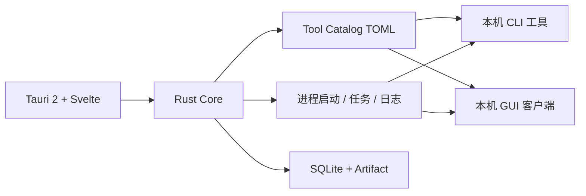

# FlagDeck

[](https://github.com/DHKun/flagdeck/actions/workflows/ci.yml)
[](https://github.com/DHKun/flagdeck/actions/workflows/packages.yml)
[](#运行环境)
[](LICENSE)

FlagDeck 是面向 **Linux x86-64** 与 **Apple Silicon macOS** 的本地安全测试工作台。

设计目标是把本机已有的 CLI 工具做成「选工具 → 填表单 → 运行 → 看日志」，而不是再去各个目录敲命令；少数必须 GUI 的工具提供一键启动。工具二进制**不进入本仓库**，通过本机路径或 Tool Pack 接入。

适用范围：CTF、靶场、实验环境与已获明确授权的安全测试。

## 功能概览

- **声明式工具目录（Tool Catalog）**：`config/tool-catalog/` 用 TOML 描述工具表单、参数与 argv；新增工具通常只需加清单，不必改枚举。
- **表单驱动运行**：按 `/data/CTF/Tools` 目录说明接入 Active / Scripts / Crypto / Binary / Defensive 等常用工具（curl、sqlmap、ffuf、RsaCtfTool、yafu、strings…）；场景卡片、目标记忆、工具搜索。
- **结果表**：ffuf 等 JSON/文本旁路输出可解析为表格（日志 / 结果双 Tab）。
- **独立应用入口**：Shiro、蚁剑/冰蝎/哥斯拉、UploadRanger、CyberChef、Payloader 等一键启动。
- **统一任务与日志**：stdout / stderr 写入本地工作区，可筛选、停止、复制、删除与清空。
- **扩展能力（进阶）**：HTTP 工作台、Metasploit RPC、Intruder / 上传、Payload 浏览等仍保留在代码中，可按需使用。

详细扩展说明见 [docs/TOOL_CATALOG.md](docs/TOOL_CATALOG.md)。

## 下载与安装

[GitHub Releases](https://github.com/DHKun/flagdeck/releases) 在推送 `v*` 标签后由 Actions 构建：

| 平台 | 产物 |
| --- | --- |
| Linux x86-64 | AppImage、DEB、RPM |
| macOS arm64（Apple Silicon） | DMG（macOS 13+） |

```bash
# AppImage
chmod +x FlagDeck_*_amd64.AppImage
./FlagDeck_*_amd64.AppImage

# DEB / RPM
sudo apt install ./FlagDeck_*_amd64.deb
sudo dnf install ./FlagDeck-*.x86_64.rpm
```

发布说明见 [docs/RELEASING.md](docs/RELEASING.md)。macOS 首次启动见 [docs/MACOS_PREVIEW.md](docs/MACOS_PREVIEW.md)。

## 架构（简图）



- **本仓库**：应用壳、Core、catalog 清单、mitmproxy worker 源码、合同与测试。
- **不入库**：ffuf、dddd、fscan、各类 WebShell 客户端、JavaFX/JDK 运行时、字典数据包等上游二进制。

## 本机工具与字典

默认工具根与字典根（可用环境变量覆盖）：

| 变量 | 默认 |
| --- | --- |
| `FLAGDECK_TOOLS_ROOT` | `/data/CTF/Tools` |
| `FLAGDECK_WORDLISTS_ROOT` | `$FLAGDECK_TOOLS_ROOT/Wordlists` |
| `FLAGDECK_CATALOG_ROOT` | 安装包/仓库内 `config/tool-catalog` |

示例布局（**用户自备，不随本仓库分发**）：

```text
/data/CTF/Tools/
  Active/dddd/dddd
  Active/fscan/...
  Active/webshell-tools/...
  Active/ShiroExploit.V2.51/...
  Wordlists/SecLists/...
```

也可继续使用系统 PATH、Tool Pack 或用户配置：

```text
$XDG_CONFIG_HOME/flagdeck/tool-paths.toml
$XDG_CONFIG_HOME/flagdeck/external-launchers.toml
```

详见 [docs/TOOL_PACKS.md](docs/TOOL_PACKS.md) 与 [config/tool-paths.example.toml](config/tool-paths.example.toml)。

## 从源码运行

使用 [mise](https://mise.jdx.dev/) 固定工具链：

```bash
git clone https://github.com/DHKun/flagdeck.git
cd flagdeck
mise install
mise run sync-all
mise run dev
```

常用命令：

```bash
mise run test        # 主程序门禁（fmt/clippy/cargo test/UI/合同）
mise run test-all    # 含 Python mitmproxy worker
mise run build       # Release 二进制
mise run package     # Linux AppImage/DEB/RPM
```

## CI 与双平台发布

| Workflow | 触发 | 作用 |
| --- | --- | --- |
| [ci.yml](.github/workflows/ci.yml) | `push`/`PR` → `main` | Ubuntu 上 `mise run test` |
| [packages.yml](.github/workflows/packages.yml) | `v*` 标签、PR、`workflow_dispatch` | **Linux** 与 **macOS arm64** 打包；标签推送时创建 GitHub Release |

推送与 `apps/desktop/src-tauri/tauri.conf.json` 中版本一致的标签即可发布，例如 `v1.0.0`。

说明：CI 只构建 FlagDeck 自身，**不会**打包你的 `/data/CTF/Tools` 第三方工具。发布包是工作台；安全工具仍由用户本机安装。

## 许可证与第三方

- FlagDeck **自有代码**： [MIT License](LICENSE)
- **依赖库**：见锁文件与 [THIRD_PARTY.md](THIRD_PARTY.md)
- **外部安全工具**（dddd、ffuf、fscan、蚁剑、冰蝎、哥斯拉、ShiroExploit 等）：**不在本仓库分发**；使用时遵守各自上游许可证与当地法律，仅限授权场景

请勿将未获再分发授权的上游二进制、JDK/JavaFX 运行时或大型字典打进本仓库或公开 Release 附件。

## 参与开发

见 [CONTRIBUTING.md](CONTRIBUTING.md)。新增 catalog 工具：在 `config/tool-catalog/tools/` 增加 TOML，并按 [docs/TOOL_CATALOG.md](docs/TOOL_CATALOG.md) 填写表单与 argv。

## 安全

见 [SECURITY.md](SECURITY.md)。公开 Issue / 截图请脱敏 Cookie、Token 与目标地址。
