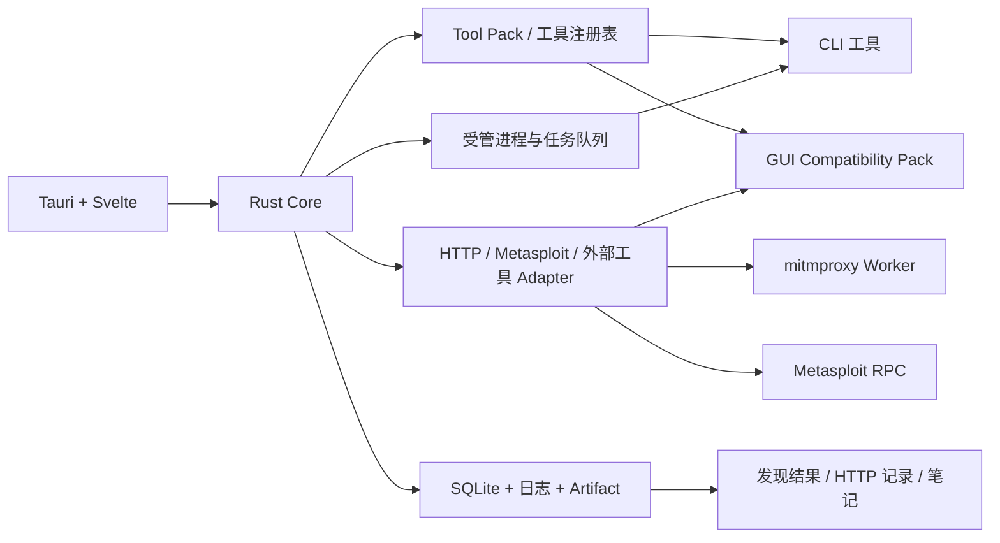

# FlagDeck

[](https://github.com/DHKun/flagdeck/actions/workflows/ci.yml)
[](https://github.com/DHKun/flagdeck/actions/workflows/macos.yml)
[](#运行环境)
[](LICENSE)

FlagDeck 是面向 Linux 与 Apple Silicon macOS 的安全测试工具箱。常用命令行工具可以直接在界面里配置和运行，任务输出、日志与解析结果统一留在 FlagDeck；少量 GUI 工具通过兼容入口启动。

适用范围包括 CTF、靶场、实验环境和已经取得明确授权的安全测试。

## 功能

- **工具箱**：集成 curl、dddd、ffuf、Arjun、fscan、gobuster、wafw00f，支持 Tool Pack、系统路径和用户路径覆盖。
- **统一运行**：后台管理工具进程，在界面中查看 stdout、stderr、任务状态与结构化发现结果。
- **HTTP 工作台**：包含代理捕获、History、Repeater、Diff、Raw HTTP 和 SQLMap 请求文件生成。
- **Metasploit**：通过本地 Loopback RPC 管理模块、选项、Job、Console 与 Session。
- **Intruder 与上传测试**：支持四种攻击模式、请求位置选择、Multipart 变异、状态宏与结果验证。
- **Payload 库**：浏览本地 TXT、YAML、JSON 数据源，提供分页、搜索和有界预览。
- **独立工具入口**：为 ShiroExploit、AntSword、Behinder、Godzilla 等桌面客户端提供启动和运行记录。

FlagDeck 启动时会自动维护本地工作区。用户只需要选择工具、填写目标并运行，无需创建或切换项目。

## 架构



界面只调用经过授权的 Tauri 命令。Rust Core 负责目标范围、工具完整性、进程生命周期、资源限制、日志读取和结果写入。详细的工具包布局与解析顺序见 [Tool Pack 文档](docs/TOOL_PACKS.md)。

## 工具接入方式

| 类型         | 接入方式                               | 仓库内容                        |
| ------------ | -------------------------------------- | ------------------------------- |
| CLI 工具     | 在 FlagDeck 内配置、运行、看日志和结果 | Adapter、清单、参数策略和解析器 |
| HTTP Runtime | 进程隔离的 mitmproxy Worker            | Worker 源码与锁文件             |
| Metasploit   | 本地 RPC Adapter                       | Rust Adapter 与凭据启动器源码   |
| GUI 工具     | 兼容入口启动独立客户端                 | Launcher 清单与完整性策略       |
| Payload 数据 | 本地目录或独立数据包                   | 浏览器实现与示例配置            |

第三方安全工具二进制不进入源码仓库。用户可以安装官方 Tool Pack，或者通过本机配置复用已经安装的工具：

```text
$XDG_CONFIG_HOME/flagdeck/tool-paths.toml
$XDG_CONFIG_HOME/flagdeck/external-launchers.toml
$XDG_CONFIG_HOME/flagdeck/payload-sources.toml

~/Library/Application Support/FlagDeck/tool-paths.toml
~/Library/Application Support/FlagDeck/external-launchers.toml
```

工具路径覆盖需要同时提供 SHA-256。示例见 [tool-paths.example.toml](config/tool-paths.example.toml)。

## 运行环境

Linux x86-64 版本需要 GTK 3 和 WebKitGTK 4.1。systemd user manager 与 cgroup v2 提供完整的进程管理，PGID 后端覆盖其他 Linux 桌面环境。

Apple Silicon 版本支持 macOS 13 及以上系统，M1–M4 芯片直接运行 arm64 DMG。安装与首次启动说明见 [macOS 预览版文档](docs/MACOS_PREVIEW.md)。

Fedora：

```bash
sudo dnf install \
  webkit2gtk4.1-devel openssl-devel curl wget file \
  libappindicator-gtk3-devel librsvg2-devel libxdo-devel
sudo dnf group install "C Development Tools and Libraries"
```

Ubuntu / Debian：

```bash
sudo apt update
sudo apt install \
  libwebkit2gtk-4.1-dev build-essential curl wget file \
  libxdo-dev libssl-dev libayatana-appindicator3-dev librsvg2-dev
```

## 从源码运行

项目使用 [mise](https://mise.jdx.dev/) 固定 Rust、Node、pnpm、Python、uv 与 Java 版本。

```bash
git clone https://github.com/DHKun/flagdeck.git
cd flagdeck

mise install
mise run sync-all
mise run dev
```

构建 Release 二进制：

```bash
mise run build
```

构建 Fedora RPM：

```bash
mise run package
```

## 开发检查

```bash
mise run test
```

完整检查包含 Rust 格式、Clippy、Workspace 测试、Svelte 类型检查、前端测试、生产构建和 Adapter 合同测试。mitmproxy Worker 的 Python 检查使用：

```bash
mise run test-all
```

## 仓库结构

```text
apps/desktop/              Tauri 2 + Svelte 桌面端
crates/                    Core、存储、执行器与协议实现
adapters/metasploit/       Metasploit RPC Adapter
workers/mitmproxy/         HTTP Worker
config/                    工具与策略清单
docs/                      Tool Pack 文档与架构决策
tests/                     合同、GUI、性能与真实输出 fixture
```

## 安全边界

- 运行目标需要进入受控 TargetScope。
- 工具入口在运行前检查路径、权限、所有权和 SHA-256。
- 高风险操作要求精确确认短语并写入审计记录。
- 日志与 Artifact 通过有界接口读取，目标 HTML 不在主 WebView 中渲染。
- 工作区、数据库、日志和证据文件使用私有权限保存。

安全问题请按 [SECURITY.md](SECURITY.md) 提交。公开 Issue 和截图应清除 Cookie、Token、目标地址与测试数据。

## 参与开发

提交 Issue 或 Pull Request 前请阅读 [CONTRIBUTING.md](CONTRIBUTING.md)。新增工具需要提供清单、固定版本、许可证信息、参数策略、解析器和对应测试。

## 许可证

FlagDeck 自有代码使用 [MIT License](LICENSE)。外部工具、运行时和数据源遵循各自的上游许可证，详细列表见 [THIRD_PARTY.md](THIRD_PARTY.md)。
