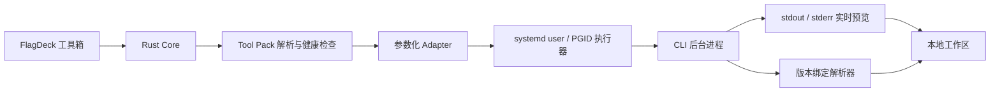

# Tool Pack

Tool Pack 是 FlagDeck 的第三方工具交付单元。它保存固定版本的可执行文件、运行时、许可证和哈希，Adapter 保存参数契约与输出解析规则。用户在工具箱中选择工具并运行，任务日志、结构化结果和原始证据统一写入本地工作区。

## 目录约定

Linux 系统安装使用 `/usr/lib/FlagDeck/tool-packs`，用户安装使用 `$XDG_DATA_HOME/flagdeck/tool-packs`。`FLAGDECK_TOOL_PACK_ROOT` 可为开发和便携部署指定根目录。

```text
tool-packs/
├── flagdeck-recon/
│   └── 1.0.0/
│       ├── bin/
│       │   ├── dddd
│       │   ├── ffuf
│       │   ├── arjun
│       │   ├── fscan
│       │   ├── gobuster
│       │   └── wafw00f
│       ├── runtime/
│       └── licenses/
└── flagdeck-gui-compat/
    └── 1.0.0/
        ├── runtime/
        ├── shiro/
        ├── antsword/
        ├── behinder/
        ├── godzilla/
        └── licenses/
```

`config/tools.toml` 定义 CLI 工具包、版本、入口、候选路径、解析器和资源上限。`config/external-launchers.toml` 定义独立 GUI 与专用客户端的兼容入口。

## 解析顺序

CLI 工具按以下顺序解析：

1. `$XDG_CONFIG_HOME/flagdeck/tool-paths.toml` 中的用户覆盖
2. `FLAGDECK_TOOL_PACK_ROOT`
3. `$XDG_DATA_HOME/flagdeck/tool-packs`
4. `/usr/lib/flagdeck/tool-packs` 与 `/usr/lib/FlagDeck/tool-packs`
5. 清单中的系统路径和启动进程的 `PATH`

用户覆盖同时声明绝对路径和 SHA-256。示例见 `config/tool-paths.example.toml`。GUI 兼容入口可由 `$XDG_CONFIG_HOME/flagdeck/external-launchers.toml` 覆盖，完整程序、工作目录、参数和必需文件都参与哈希校验。

## 执行链



每次任务启动前都会重新解析入口并校验 owner、写权限和 SHA-256。命令通过结构化 argv 启动，目标 Scope、超时、内存、任务数和 CPU 上限继续生效。

## 发布方式

GitHub Release 可以按平台提供应用 RPM 和 Tool Pack RPM。应用包安装界面、Core、Adapter 与配置；Recon Pack 安装常用 CLI 和所需运行时；GUI Compatibility Pack 保存需要独立窗口的工具。体积较大的 Metasploit 与 GUI Pack保持可选安装，FlagDeck 负责启动、运行记录和健康状态。

第三方文件进入发布包前需要满足四项条件：固定上游版本、可复现来源、许可证允许再分发、生成 SHA-256 与 SBOM 条目。许可证正文随对应 Tool Pack 安装。
